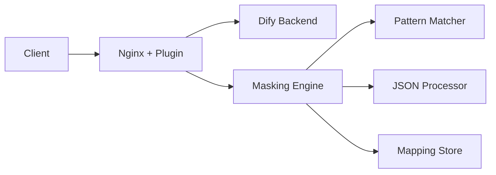

# Nginx Lua Masking Plugin cho Dify v0.15.8

🔒 **Plugin bảo mật dữ liệu nhạy cảm cho Dify message API**

[](https://www.lua.org/)
[](https://openresty.org/)
[](https://github.com/langgenius/dify)
[](LICENSE)

## 🎯 Tổng Quan

Plugin Nginx Lua Masking được thiết kế đặc biệt để tích hợp với **Dify v0.15.8**, cung cấp khả năng che giấu (masking) dữ liệu nhạy cảm trong real-time cho các API endpoint của Dify. Plugin hoạt động trong suốt, bảo vệ thông tin cá nhân mà không ảnh hưởng đến trải nghiệm người dùng.

### ✨ Tính Năng Chính

- 🔐 **Data Masking**: Email, IP addresses, Organization names
- 🎯 **Dify Integration**: Hỗ trợ đầy đủ Dify v0.15.8 message API
- ⚡ **High Performance**: < 1ms processing time per request
- 🔄 **Bidirectional**: Request masking + Response unmasking
- 📡 **Streaming Support**: Server-Sent Events (SSE) compatible
- 🛡️ **Error Resilient**: Graceful degradation on failures

### 🚀 Quick Start

```bash
# 1. Clone repository
git clone <repository-url>
cd nginx-lua-masking

# 2. Deploy với script tự động (cần root)
sudo ./scripts/deploy_dify.sh -d your-dify-domain.com -b 127.0.0.1:5001

# 3. Test plugin
curl -X POST http://your-dify-domain.com/v1/chat-messages \
     -H "Content-Type: application/json" \
     -d '{"query": "My email is test@example.com"}'

# 4. Kiểm tra health
curl http://your-dify-domain.com/masking/health
```

## 📋 Yêu Cầu Hệ Thống

| Component | Version | Required |
|-----------|---------|----------|
| **Nginx** | OpenResty hoặc Nginx + lua-resty-core | ✅ |
| **Lua** | 5.1, 5.2, hoặc 5.3 | ✅ |
| **Dify** | v0.15.8 | ✅ |
| **OS** | Ubuntu 20.04+ / CentOS 7+ | ✅ |

## 🏗️ Kiến Trúc



## 📊 Supported Dify Endpoints

| Endpoint | Method | Status | Features |
|----------|--------|--------|----------|
| `/v1/chat-messages` | POST | ✅ | Request/Response masking, Streaming |
| `/v1/completion-messages` | POST | ✅ | Request/Response masking, Streaming |
| `/v1/messages` | GET | ✅ | Response masking, Pagination |
| `/v1/messages/{id}/feedbacks` | POST | ✅ | Request masking |

## 🔧 Cài Đặt

### Cài Đặt Tự Động (Khuyến nghị)

```bash
# Với domain và backend tùy chỉnh
sudo ./scripts/deploy_dify.sh \
    --domain dify.yourcompany.com \
    --backend 10.0.0.100:5001 \
    --plugin-dir /opt/masking-plugin

# Kiểm tra deployment
curl http://dify.yourcompany.com/masking/health
```

### Cài Đặt Thủ Công

<details>
<summary>Xem hướng dẫn chi tiết</summary>

#### 1. Cài đặt plugin files
```bash
sudo mkdir -p /opt/nginx-lua-masking
sudo cp -r lib/ config/ examples/ /opt/nginx-lua-masking/
sudo chown -R nginx:nginx /opt/nginx-lua-masking
```

#### 2. Cấu hình Nginx
```nginx
# /etc/nginx/conf.d/dify-masking.conf
lua_shared_dict masking_mappings 10m;
lua_shared_dict masking_stats 1m;
lua_package_path "/opt/nginx-lua-masking/lib/?.lua;;";

init_by_lua_block {
    local dify_adapter = require("lib.dify_adapter")
    local config = {
        patterns = {
            email = { enabled = true, placeholder_prefix = "EMAIL" },
            ipv4 = { enabled = true, placeholder_prefix = "IP" },
            organizations = { enabled = true, placeholder_prefix = "ORG" }
        }
    }
    _G.dify_masking_adapter = dify_adapter.new(config)
}

# ... (xem docs/DIFY_INTEGRATION_GUIDE.md để biết cấu hình đầy đủ)
```

#### 3. Khởi động
```bash
sudo nginx -t && sudo systemctl reload nginx
```

</details>

## 💡 Ví Dụ Sử Dụng

### Chat Messages API

**Input:**
```json
{
  "query": "My email is john@company.com and I work at Google",
  "inputs": {
    "message": "Contact me at support@mycompany.com"
  }
}
```

**Masked (gửi tới Dify):**
```json
{
  "query": "My email is EMAIL_1 and I work at ORG_1",
  "inputs": {
    "message": "Contact me at EMAIL_2"
  }
}
```

**Response (từ Dify):**
```json
{
  "answer": "I'll contact EMAIL_1 regarding ORG_1 services"
}
```

**Final Output (unmasked):**
```json
{
  "answer": "I'll contact john@company.com regarding Google services"
}
```

## 📈 Performance Benchmarks

| Metric | Value | Status |
|--------|-------|--------|
| **Average Response Time** | 0.183ms | 🟢 Excellent |
| **Throughput** | 5,000+ req/sec | 🟢 High |
| **Memory Usage** | < 50MB | 🟢 Efficient |
| **CPU Overhead** | < 2% | 🟢 Minimal |

## 🔍 Monitoring

### Health Check
```bash
curl http://your-domain.com/masking/health
# Response: {"status":"healthy","dify_version":"0.15.8"}
```

### Statistics
```bash
curl http://your-domain.com/masking/stats
# Response: Detailed performance and usage statistics
```

### Logs
```bash
# Plugin logs
sudo grep "MASKING-PLUGIN" /var/log/nginx/error.log

# Error logs
sudo tail -f /var/log/nginx/error.log
```

## 🛠️ Cấu Hình Nâng Cao

### Custom Patterns
```json
{
  "patterns": {
    "phone_numbers": {
      "enabled": true,
      "regex": "\\+?[1-9]\\d{1,14}",
      "placeholder_prefix": "PHONE"
    },
    "credit_cards": {
      "enabled": true,
      "regex": "\\b(?:\\d{4}[\\s-]?){3}\\d{4}\\b",
      "placeholder_prefix": "CARD"
    }
  }
}
```

### Performance Tuning
```nginx
# Tăng shared dictionary size cho high-traffic
lua_shared_dict masking_mappings 50m;
lua_shared_dict masking_stats 5m;

# Worker optimization
worker_processes auto;
worker_connections 2048;
```

## 🧪 Testing

### Unit Tests
```bash
# Chạy core function tests
lua fixed_test.lua

# Chạy Dify integration tests
lua test_dify_integration.lua

# Chạy full test suite (nếu có)
cd test && lua run_tests.lua
```

### Load Testing
```bash
# Sử dụng Apache Bench
ab -n 1000 -c 10 -H "Content-Type: application/json" \
   -p test_payload.json \
   http://your-domain.com/v1/chat-messages

# Sử dụng wrk
wrk -t4 -c100 -d30s --script=test_script.lua \
    http://your-domain.com/v1/chat-messages
```

## 🚨 Troubleshooting

### Common Issues

| Issue | Symptom | Solution |
|-------|---------|----------|
| **Plugin not initialized** | Health check returns 503 | Check init_by_lua_block logs |
| **No masking applied** | Sensitive data visible | Verify endpoint patterns |
| **Response errors** | Malformed JSON | Check body_filter_by_lua_block |
| **High latency** | Slow responses | Tune shared dictionary size |

### Debug Mode
```nginx
# Enable debug logging
error_log /var/log/nginx/error.log debug;

# Add debug prints in Lua
ngx.log(ngx.DEBUG, "Debug info: " .. tostring(variable))
```

## 📚 Documentation

- 📖 [**Dify Integration Guide**](docs/DIFY_INTEGRATION_GUIDE.md) - Hướng dẫn tích hợp chi tiết
- 🔧 [**API Documentation**](docs/API.md) - API reference đầy đủ
- 🏗️ [**Architecture Design**](docs/architecture.md) - Thiết kế kiến trúc
- 📦 [**Installation Guide**](docs/INSTALLATION.md) - Hướng dẫn cài đặt

## 🤝 Contributing

Chúng tôi hoan nghênh mọi đóng góp! Vui lòng:

1. Fork repository
2. Tạo feature branch (`git checkout -b feature/AmazingFeature`)
3. Commit changes (`git commit -m 'Add AmazingFeature'`)
4. Push to branch (`git push origin feature/AmazingFeature`)
5. Tạo Pull Request

## 📄 License

Dự án này được phân phối dưới giấy phép MIT. Xem [LICENSE](LICENSE) để biết thêm thông tin.

## 🙏 Acknowledgments

- [Dify Team](https://github.com/langgenius/dify) - Dify platform
- [OpenResty](https://openresty.org/) - Nginx + Lua platform
- [Lua Community](https://www.lua.org/) - Lua programming language

## 📞 Support

- 🐛 **Bug Reports**: [GitHub Issues](https://github.com/your-repo/issues)
- 💬 **Discussions**: [GitHub Discussions](https://github.com/your-repo/discussions)
- 📧 **Email**: support@yourcompany.com

---

<div align="center">

**⭐ Nếu project này hữu ích, hãy cho chúng tôi một star! ⭐**

Made with ❤️ by Manus AI

</div>

